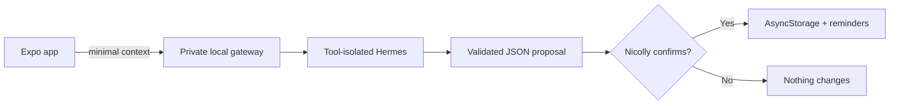

<div align="center">
  
  <h1>🖤 Nicolly's Agenda 💜</h1>
  <p><strong>A loving, punk-kawaii, fully personalized planner.</strong></p>
  <p>Built to organize Nicolly's days with purple hearts, attitude, and a little magic.</p>
  <p>
    
    
    
    
  </p>
  <p>
    
    
    
  </p>
  <p>⋆｡‧˚ʚ 🖤 ɞ˚‧｡⋆</p>
</div>

> [!IMPORTANT]
> This project was built with substantial AI assistance. The idea, care, and
> product decisions belong to Gustavo Martins; implementation, interface,
> tests, documentation, and Android preparation were developed under human
> supervision. Read [`AI_DISCLOSURE.md`](AI_DISCLOSURE.md).

## 💜 A very personal corner

Nicolly's Agenda began as a gift: a private app for appointments, reminders,
and affectionate notes in a Kuromi-inspired punk-kawaii experience. Agenda data
stays on the device, and the local intelligent assistant is optional.

Android/Xiaomi is the primary target. The interface also runs on the web for
development and demonstrations.

## ✨ What shines today

| Today | Calendar | KuromI.A | Nicolly's corner |
| --- | --- | --- | --- |
| Weekly strip and next event | Month, week, and day views | Text conversation | Custom affectionate message |
| Clear event states | Create and edit appointments | Create/update/delete proposals | Optional reduced effects |
| Completion and deletion feedback | Time, duration, categories, notes | Human confirmation required | Purple punk-kawaii identity |
| Persistent local reminders | Date navigation and details | Honest offline/error states | Responsive, accessible layout |

- local persistence with AsyncStorage;
- scheduled local notifications with rescheduling and cancellation;
- voice recording flow prepared for clips up to 90 seconds;
- private Hermes credentials never shipped inside the APK;
- safe areas, readable contrast, large touch targets, and accessibility labels;
- no assistant proposal can alter the agenda before explicit confirmation.

<div align="center">
  
  <p><em>cute, organized, and full of attitude 🖤</em></p>
</div>

## 🧠 Meet KuromI.A

KuromI.A is the agenda's own assistant persona: confident, playful, slightly
sassy, and secretly caring. She helps interpret natural-language requests as
structured appointment proposals.



Hermes cannot execute tools, commands, or agenda mutations in this profile. It
returns a bounded JSON object; the server validates it, and the app remains the
only source of truth.

## 💡 Ideas can become pull requests

The new **Recommendations** tab gives Nicolly a place to describe what she
would like to see next. Suggestions are stored locally with their date, target,
and progress state, then linked to the public GitHub initiative for tracking.

The product rule is explicit: AI may organize a request, but Gustavo reviews
the idea and no code change is accepted without human approval.

## 📱 Platform status

| Platform | Agenda | Assistant | Reminders |
| --- | --- | --- | --- |
| **Android / Xiaomi** | Primary offline experience | Local backend via `adb reverse` | Implemented; final physical validation pending |
| **Web** | Development and demos | Works with backend on the same computer | Web notifications differ from native ones |
| **Physical iPhone** | Offline agenda | Current local transport unavailable | Not validated yet |

## 🚀 Run locally

Requirements: Node.js 20+, npm, and the Expo-supported Android toolchain.

```bash
npm install
npm start
```

Useful targets:

```bash
npm run android
npm run web
```

### Optional local assistant

The assistant requires the local server and a separately configured Hermes
instance. Copy the example environment file, keep secrets outside the app, and
follow [`server/README.md`](server/README.md) for the current gateway setup.

## 🧁 Project structure

```text
src/app/          Expo Router screens and tabs
src/components/   reusable themed UI
src/data/         local persistence adapters
src/domain/       events, chat, and recommendation contracts
src/services/     notifications and proposal execution
server/           private Hermes gateway and validation
assets/           app icon and themed artwork
shared/           contracts shared by app and server
```

## 🧪 Quality

```bash
npm run typecheck
npm test
npm run doctor
npm run export:android
```

Tests focus on date behavior, persistence, reminders, assistant validation,
proposal safety, and the user flows that matter on a real phone.

## 🧷 Honest boundaries

- no account, cloud sync, or multi-device collaboration;
- assistant availability depends on the private local gateway;
- voice capture exists, but transport/transcription still follows the local setup;
- iOS physical-device support is not complete;
- recommendations are locally tracked and linked to GitHub; they are not an
  autonomous code-deployment system.

## 🌙 Privacy first

Appointments and recommendations stay on the device. The assistant receives
only the context required for the current conversation. Secrets remain on the
server, and every mutation requires visible human confirmation.

## 🎀 Kuromi and Sanrio

This is a personal, non-commercial, fan-inspired open-source project. Kuromi is
a character and trademark of Sanrio. This repository is not affiliated with,
endorsed by, or sponsored by Sanrio. The MIT license covers the source code,
not third-party characters, names, trademarks, or artwork.

## 📄 License

Source code is available under the [MIT License](LICENSE).
