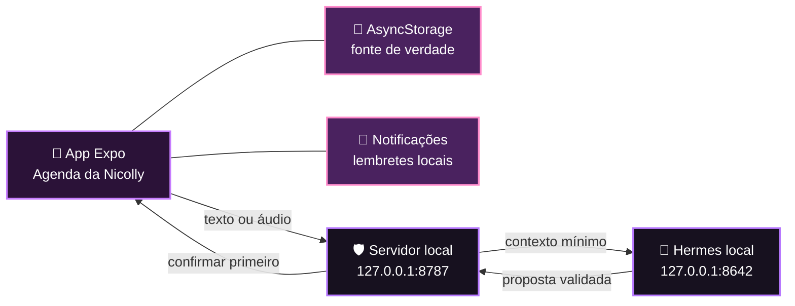

<div align="center">
  

  <h1>🖤 Agenda da Nicolly 💜</h1>

  <p><strong>Uma agenda punk-kawaii, carinhosa e totalmente personalizada.</strong></p>
  <p>Feita para organizar os dias da Nicolly com corações roxos, atitude e um pouquinho de magia. ✨</p>

  <p>
    
    
    
    
  </p>
  <p>
    
    
    
  </p>

  <p>⋆｡‧˚ʚ 🖤 ɞ˚‧｡⋆</p>
</div>

> [!IMPORTANT]
> **Este projeto foi desenvolvido com assistência substancial de IA.** A ideia,
> a dedicação e as decisões de produto são de Gustavo Martins; implementação,
> interface, testes, documentação e preparação Android contaram principalmente
> com o apoio de ferramentas de inteligência artificial. Leia a
> [declaração completa de transparência](./AI_DISCLOSURE.md).

## 💜 Sobre este cantinho

A Agenda da Nicolly nasceu como um presente: um aplicativo pessoal para cuidar
de compromissos, lembretes e pequenos recados em uma experiência inspirada na
estética punk-kawaii da Kuromi. Os dados da agenda ficam no próprio aparelho, e
o assistente inteligente local é opcional.

Ela foi desenhada primeiro para Android/Xiaomi, mas a interface também funciona
na web para desenvolvimento e demonstração.

## ✨ O que já brilha

| 💜 Hoje | 🗓️ Calendário | 🧠 Assistente | 🖤 Cantinho |
| --- | --- | --- | --- |
| faixa semanal e próximo compromisso | visões mensal, semanal e diária | conversa por texto com histórico local | recadinho afetivo personalizável |
| eventos do dia com estados claros | criação e edição de compromissos | propostas de criar, editar e excluir | redução opcional de efeitos visuais |
| conclusão e exclusão com feedback | horários, duração, categorias e notas | confirmação humana obrigatória | identidade roxa punk-kawaii |
| lembretes locais persistentes | navegação por datas e detalhes | estado offline e erros honestos | layout responsivo e acessível |

### Pequenos detalhes que fazem diferença

- 💟 persistência local com AsyncStorage;
- 🔔 notificações locais com reagendamento e cancelamento;
- 🎙️ gravação de até 90 segundos, duração, descarte e envio preparados;
- 🛡️ o APK nunca recebe a chave privada do Hermes;
- ✅ nenhuma ação sugerida pelo assistente altera a agenda sem confirmação;
- ♿ áreas seguras, contraste, alvos de toque e rótulos de acessibilidade.

<div align="center">
  
  <p><em>fofa, organizada e com atitude 🖤</em></p>
</div>

## 📱 Onde funciona hoje

| Plataforma | Agenda | Assistente | Lembretes |
| --- | --- | --- | --- |
| **Android/Xiaomi** | experiência principal e offline | via backend local e `adb reverse` | implementados; validação física final pendente |
| **Web** | desenvolvimento e demonstração | funciona com backend no mesmo computador | notificações web não equivalem às nativas |
| **iPhone físico** | agenda offline | indisponível com o transporte local atual | ainda não validados neste projeto |

## 🪄 Como tudo conversa



O aplicativo é sempre a fonte de verdade. O servidor interpreta a conversa e
devolve apenas uma proposta validada; salvar, editar ou excluir depende do toque
em **Confirmar**.

## 🧁 Stack do projeto

| Camada | Tecnologia |
| --- | --- |
| aplicativo | Expo SDK 57, React Native 0.86 e Expo Router |
| linguagem | TypeScript 6 e React 19 |
| interface | Expo Linear Gradient, React Native SVG e Lucide Icons |
| dados locais | AsyncStorage |
| lembretes | Expo Notifications |
| áudio | Expo Audio |
| servidor privado | Node.js, Fastify e Zod |
| assistente opcional | Hermes Agent local, protegido pelo backend |
| qualidade | Vitest, TypeScript e Expo Doctor |

## 🚀 Rodando localmente

### Pré-requisitos

- Node.js 22.13 ou superior;
- npm;
- Expo e um navegador, emulador ou aparelho Android;
- Hermes apenas se você quiser testar o assistente inteligente.

### Aplicativo

```bash
git clone https://github.com/gustavomartins-dev/agenda-namorada.git
cd agenda-namorada
npm install
npm run web
```

Para executar o projeto nativo Android com o SDK configurado:

```bash
npm run android
```

### Assistente local opcional

O Hermes nunca deve ser chamado diretamente pelo aplicativo. Leia primeiro o
[guia de segurança e configuração do servidor](./server/README.md).

```bash
cd server
cp .env.example .env
npm install
npm run dev
```

No Xiaomi conectado por USB, encaminhe somente a porta do backend:

```bash
adb reverse tcp:8787 tcp:8787
```

## 🧪 Qualidade

```bash
# aplicativo
npm run typecheck
npm test
npm run doctor
npm run export:android

# servidor
cd server
npm run typecheck
npm test
npm run build
```

Estado verificado da v1:

- ✅ 15 testes do aplicativo;
- ✅ 22 testes do servidor;
- ✅ 21/21 verificações do Expo Doctor;
- ✅ APK release standalone compilado e validado localmente;
- ⏳ instalação e smoke test finais em um Xiaomi real;
- ⏳ transcrição local, dependente de Whisper, FFmpeg e FFprobe;
- ⏳ chave de assinatura Android definitiva.

## 🗺️ Próximos desejos

- [ ] validar toda a experiência em um Xiaomi com MIUI/HyperOS;
- [ ] habilitar transcrição de áudio totalmente local;
- [ ] criar assinatura permanente para atualizações do APK;
- [ ] ampliar busca, filtros e eventos recorrentes;
- [ ] adicionar mais opções de personalização sem perder acessibilidade.

## 🧷 Escopo atual — sem glitter falso

- a transcrição fica desabilitada por padrão até configurar Whisper, FFmpeg e
  FFprobe localmente;
- ainda não existem conta, nuvem, sincronização, backup ou compartilhamento;
- busca, filtros e eventos recorrentes continuam no roadmap;
- não há APK oficial publicado nem versão disponível na Play Store;
- a primeira validação completa em um Xiaomi real ainda está pendente.

## 🌙 Privacidade primeiro

- compromissos e preferências permanecem no aparelho;
- não há autenticação, telemetria ou banco remoto;
- `.env`, chaves, sessões Hermes e APKs locais são ignorados pelo Git;
- o backend aceita apenas loopback nesta etapa;
- a porta privada do Hermes não é exposta ao celular nem à rede.

## 🌟 Open source e contribuições

O código original deste repositório está disponível sob a
[licença MIT](./LICENSE). Ideias, issues e pull requests são bem-vindos — veja
[como contribuir](./CONTRIBUTING.md).

As artes, marcas e referências visuais da Kuromi/Sanrio **não fazem parte da
licença MIT do código**. Consulte o [aviso sobre assets e marcas](./ASSET_NOTICE.md)
antes de reutilizar qualquer imagem. Dependências e scaffolds de terceiros
mantêm suas próprias licenças; veja [THIRD_PARTY_NOTICES.md](./THIRD_PARTY_NOTICES.md).

## 🤖 Transparência sobre IA

Este não é um projeto que apenas “recebeu uma ajudinha” de IA: a IA participou
substancialmente da construção técnica. Ferramentas de inteligência artificial
apoiaram arquitetura, implementação, UI, testes, documentação e Android, sempre
sob direção e aprovação humanas. Os detalhes estão em
[AI_DISCLOSURE.md](./AI_DISCLOSURE.md).

## 🎀 Kuromi e Sanrio

Este é um fan project pessoal, de finalidade não comercial e publicado para fins
de aprendizado e colaboração. Kuromi e Sanrio pertencem aos seus respectivos
titulares. O projeto não é oficial, licenciado, patrocinado, aprovado nem afiliado
à Sanrio.

<div align="center">
  <p>⋆｡‧˚ʚ 💜 ɞ˚‧｡⋆</p>
  <strong>Feito com carinho para a Nicolly.</strong>
  <br />
  <sub>organizar também pode ser fofo, roxo e um pouquinho rebelde 🖤</sub>
</div>
